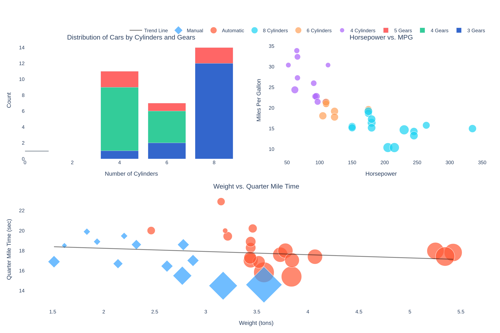

# Interactive Data Visualization with Plotly



## Overview

This repository contains an interactive data visualization project created with R, R Markdown, and Plotly. The project demonstrates how to create engaging, interactive visualizations that allow users to explore data more deeply than traditional static charts.

The presentation showcases various visualization techniques using the classic `mtcars` dataset, highlighting the relationships between different car attributes such as cylinders, gears, horsepower, MPG, and quarter-mile time.

## Live Demo

You can view the live interactive presentation at: [https://galafis.github.io/R-Markdown-Presentation-Plotly/](https://galafis.github.io/R-Markdown-Presentation-Plotly/)

## Features

- **Interactive Visualizations**: All charts are fully interactive, allowing users to hover for details, zoom, pan, and more
- **Multiple Chart Types**: Demonstrates stacked bar charts, scatter plots with size encoding, and trend lines
- **Responsive Design**: Works seamlessly on desktop and mobile devices
- **Clean Code**: Well-documented R code for reproducibility
- **Professional Styling**: Custom CSS for a polished presentation

## Project Structure

```
R-Markdown-Presentation-Plotly/
├── index.html              # Web version of the presentation with interactive Plotly charts
├── presentation.Rmd        # R Markdown source file for the presentation
├── styles.css              # Custom CSS styles for the presentation
├── data/
│   └── mtcars.csv          # Dataset used for the visualizations
├── images/                 # Directory containing images for the README
└── README.md               # This documentation file
```

## Visualizations Included

1. **Cars by Number of Forward Gears and Cylinders**
   - A stacked bar chart showing the distribution of cars by their number of cylinders and gears
   - Demonstrates categorical data visualization and grouping

2. **Horsepower vs. MPG**
   - An interactive scatter plot showing the relationship between horsepower and fuel efficiency
   - Uses color to encode cylinder count and size to represent car weight
   - Demonstrates multi-dimensional data visualization

3. **Weight vs. Quarter Mile Time**
   - A scatter plot with trend line showing how car weight affects quarter-mile time
   - Uses different symbols and colors to distinguish between automatic and manual transmissions
   - Demonstrates relationship analysis with visual encoding and trend visualization

## How to Use

### Viewing the Presentation

Simply visit the [GitHub Pages site](https://galafis.github.io/R-Markdown-Presentation-Plotly/) to view the interactive presentation.

### Running Locally

1. Clone this repository:
   ```
   git clone https://github.com/galafis/R-Markdown-Presentation-Plotly.git
   ```

2. Navigate to the project directory:
   ```
   cd R-Markdown-Presentation-Plotly
   ```

3. If you want to view the web version:
   - Open `index.html` in your web browser

4. If you want to compile the R Markdown presentation:
   - Make sure you have R installed with the required packages:
     ```R
     install.packages(c("rmarkdown", "plotly", "dplyr"))
     ```
   - Render the presentation:
     ```R
     rmarkdown::render("presentation.Rmd")
     ```

## Customization

You can customize the visualizations by modifying the R code in the `presentation.Rmd` file. The web version can be customized by editing the `index.html` and `styles.css` files.

## Technical Details

### Technologies Used

- **R**: For data processing and analysis
- **R Markdown**: For creating the reproducible presentation
- **Plotly**: For creating interactive visualizations
- **HTML/CSS/JavaScript**: For the web version of the presentation
- **Bootstrap**: For responsive layout and styling

### Data Source

The project uses the `mtcars` dataset, which contains data from the 1974 Motor Trend US magazine. It comprises fuel consumption and 10 aspects of automobile design and performance for 32 automobiles.

## Future Enhancements

- Add more advanced Plotly features such as animations and 3D plots
- Integrate with Shiny for even more interactivity
- Expand the dataset with more recent car models
- Add comparative analysis between different car manufacturers

## License

This project is licensed under the MIT License - see the LICENSE file for details.

## Author

Created by Gabriel Demetrios Lafis on May 28, 2025.

---

© 2025 Gabriel Demetrios Lafis. All rights reserved.
